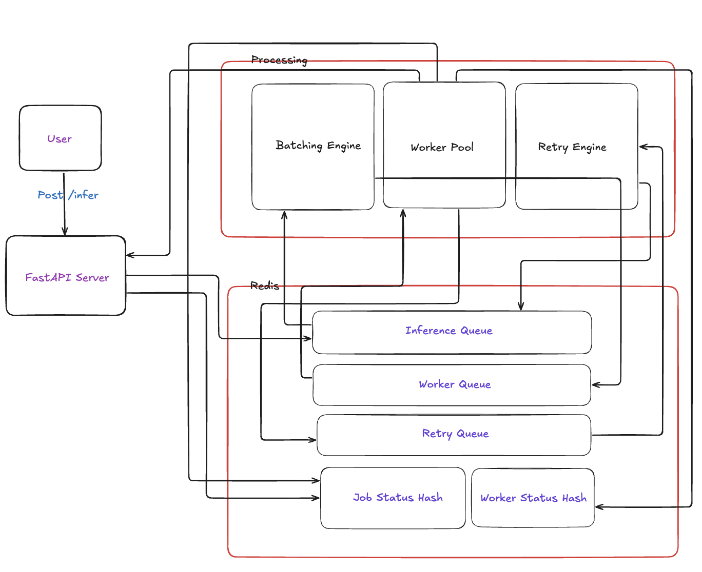
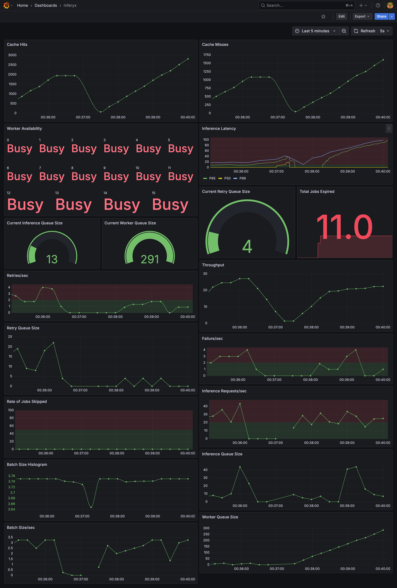
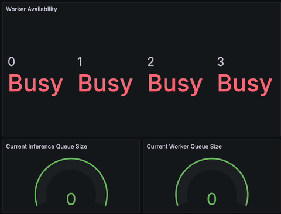

# Inferyx - A Production-Grade AI Inference Engine

Inferyx is a high-performance inference system that simulates production-grade AI infrastructure.

It mimics what happens *after* a `/predict` API is called: job queuing, batching, caching, retrying, worker pooling, and full observability, just like you’d expect in a real world deployment powering millions of requests.

> 🧠 Built to demonstrate real-world AI Systems Engineering skills — infra, latency, load, and failure handling — **not just another model deployment.**

---


## 🚀 Features

- 🔁 **Async Inference Queue** with Redis-based queuing
- 📦 **Batching Engine** that groups jobs for optimal throughput
- 🔨 **Simulated GPU Worker Pool** (with dynamic scaling up and down)
- ❌ **Failure Simulation + Retry Queue** with exponential backoff
- ⚡ **Redis Cache Layer** with hit/miss metrics
- 📈 **Prometheus + Grafana Monitoring** (latency, retries, throughput, worker state)
- 🔥 **Load Testing Utility** to simulate thousands of requests
- 🧪 **Multi-model Routing** (based on `model_id`)
- 🐳 Fully **containerized** with Docker + Docker Compose

---

## System Architecture



## 📦 How to Run (Local Dev)

### ✅ Prerequisites
- Docker
- Docker Compose

### 🛠️ One-Command Boot

```bash
docker-compose up --build
```

This will spin up:
- FastAPI App
- Batching Engine
- Worker Pool
- Retry Worker
- Redis
- Prometheus
- Grafana

---

> NOTE: The real model integrated is a Financial Aspect Based Sentiment Analysis model. For more training and model details, see [here.](https://github.com/LakshyaSingh354/FABSA/tree/main/fabsa-model)

> Kindly download the `onnx` model and put it in the root directory with name "onnx". Download the model from [here](https://www.kaggle.com/models/lakshyasingh354/fabsa).

## 🧪 Test It

### 🔄 Send Inference Request

```bash
curl -X POST http://localhost:8000/infer \
    -H "Content-Type: application/json" \
    -d '{"input": "your text here", "model_id": "mock"}'
```
> Or make automatic requests using `inferyx.py`. Configure the variables according to the testing parameters.

### 📊 Monitor the System

- **Prometheus**: [http://localhost:9090](http://localhost:9090)  
- **Grafana**: [http://localhost:3000](http://localhost:3000)  
    - Login: `admin` / `admin`
    - Dashboard: [*Inferyx*](http://localhost:3000/d/inferyx/inferyx)

---

## 📈 Metrics Tracked

- 🔁 `inference_queue_size`, `worker_queue_size`, `retry_queue_size`
- 📦 `batch_size`, `batches_processed`
- 🧠 `worker_utilization`
- 🐢 `latency_p50`, `latency_p95`, `latency_p99`
- 🔁 `retry_attempts`, `failed_jobs`
- 💥 `cache_hits`, `cache_misses`
- 🔂 `requests_per_second`

---

## ⚠️ Failure Handling

- X% of jobs are simulated to fail (configurable)
- Failed jobs pushed to a **retry queue**
- Retry loop uses **exponential backoff**
- Max retry attempts configurable
- Observability baked in (retry delay, attempts)

---

## 🧠 Design Philosophy

Inferyx is not a “deploy a model” demo.  
It’s a **simulation of real AI infra problems**:

- What happens when 1000 clients hit `/infer`?
- Can jobs be batched without losing latency SLAs?
- How are failed jobs retried and monitored?
- Can you track the system under pressure?

---

## 📸 Screenshots



Dynamic Scaling up and down.

---

## 🔧 Configurable Constants

Set via `config.py`:

```python
# Batching
INFERENCE_QUEUE_KEY = "inference_queue"
WORKER_QUEUE_KEY = "worker_queue"
MAX_BATCH_SIZE = 4
MAX_WAIT_TIME = 1.0

# Queue
MAX_QUEUE_SIZE = 500

# Retry
RETRY_QUEUE_KEY = "retry_queue"
MAX_RETRIES = 3
RETRY_BACKOFF_SECONDS = 2
MAX_BACKOFF_SECONDS = 30

# Workers
MAX_WORKERS = 16
MIN_WORKERS = 1
JOBS_PER_WORKER = 10
CHECK_INTERVAL = 5

# Metrics
PROMETHEUS_MULTIPROC_DIR = "/tmp/prometheus_multiproc"
METRICS_PORT = 8080
```

---
## 📁 Repo Structure
```.
└── Inferyx/
    ├── api/
    │   ├── auth.py
    │   ├── main.py
    │   └── schema.py
    ├── batch/
    │   └── batching_engine.py
    ├── caching/
    │   └── cache_inference.py
    ├── config/
    │   └── config.py
    ├── job_queue/
    │   ├── job_store.py
    │   ├── producer.py
    │   ├── redis_client.py
    │   ├── schema.py
    │   └── utils.py
    ├── metrics/
    │   ├── metrics.py
    │   └── serve.py
    ├── model/
    │   ├── FABSA.py
    │   ├── infer.py
    │   └── test_infer.py
    ├── retry/
    │   ├── retry.py
    │   ├── retry_worker.py
    │   └── utils.py
    ├── workers/
    │   ├── worker_loop.py
    │   └── worker_pool.py
    ├── onnx/
    ├── README.md
    ├── docker-compose.yaml
    ├── Dockerfile
    ├── inferyx.py
    ├── prometheus.yaml
    ├── pyproject.toml
    ├── requirements.txt
    ├── startup.sh
    ├── uv.lock
    └── .python-version
```
---
## 🧾 TODO (Future Work)

- [ ] gRPC Gateway
- [ ] Model Registry Integration
- [ ] Kubernetes + HPA
- [ ] Triton Inference Server integration